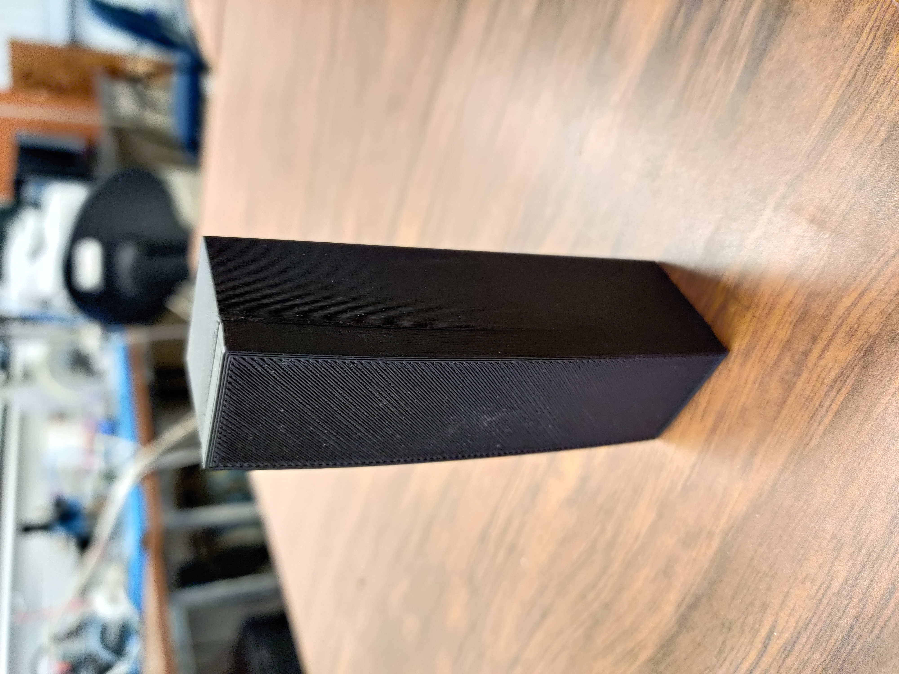
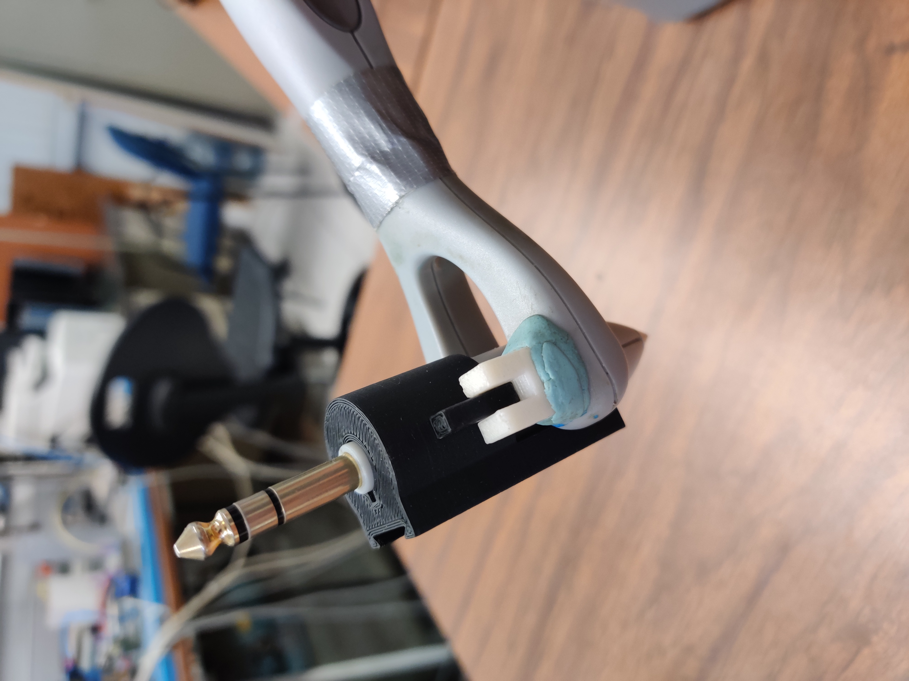
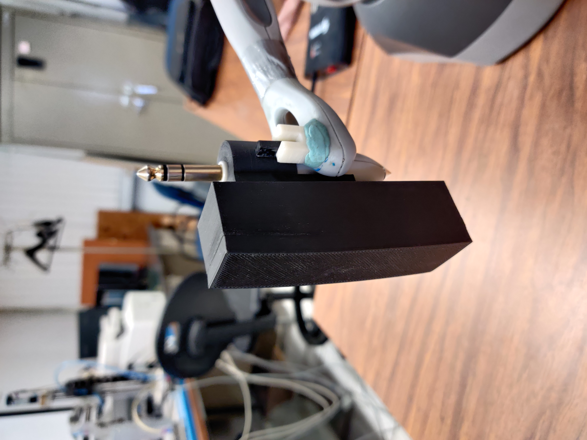

# 🕹️ Geomagic Touch: Simulation & Experimental Validation

This module contains the **MATLAB/Simulink simulation environment** and the **experimental data validation** for the full system parameter identification (robot + payload) using the MDREM algorithm on the Geomagic Touch haptic device.

> ⚠️ **Implementation Note:** Due to laboratory intellectual property guidelines, the low-level C++ control firmware for the physical Geomagic Touch is not publicly shared. However, the complete simulation environment (which mimics the real system dynamics) and the experimental data logs proving hardware convergence are fully provided here.

---

## ⚙️ Technical Implementation Details

To keep this documentation highly scannable, detailed dynamic model and linear parameterization are collapsed below. Click to expand:

<b>1. Denavit-Hartenberg (DH) Parameters</b>

 

Recall that the Geomagic Touch was modeled using a simplified three-degree-of-freedom (3-DoF) configuration. The figure below details this standard Denavit–Hartenberg (DH) geometric setup, and the subsequent table presents the corresponding DH parameters.

  
  
<em>Figure 1.1. Denavit-Hartenberg configuration of the simplified 3 DoF Geomagic touch.</em>

| Joint | $a_i$ [m] | $d_i$ [m] | $\alpha_i$ [rad] | $q_i$ [rad] |
|-------|-----------|-----------|------------------|-------------|
| 1     | 0         | 0         | $\pi/2$          | $q_1^*$     |
| 2     | 0.145     | 0         | 0                | $q_2^*$     |
| 3     | 0.1738    | 0         | 0                | $q_3^*$     |

$*$ variable quantity

<b>2. Dynamic Model</b>

 
  
To achieve a reduced-order parameter formulation, several geometric simplifications were applied to the manipulator's links and payload. To see the full model derivation and  assumptions consult the master's thesis here [view thesis](../docs/Master_thesis_Ernesto.pdf)

The dynamic model then is given by

$$\boldsymbol{H}(\boldsymbol{q}) \ddot{\boldsymbol{q}}+\boldsymbol{C}(\boldsymbol{q},\dot{\boldsymbol{q}})\dot{\boldsymbol{q}}+\boldsymbol{D} \dot{\boldsymbol{q}}+\boldsymbol{g}(\boldsymbol{q})=\boldsymbol{\tau}.$$

The model can be expressed in terms of a set of ten parameters, which are the following:

  
  
<em></em>

where $m_i$ is the mass of the *i*-th link for $i = 1,2,3$; $\ell_{ci}$ is the distance from the origin of the frame $O_{x_{i-1}, y_{i-1}, z_{i-1}}$ to the center of mass of the *i*-th body for $i = 2,3$; $`\boldsymbol{I}_{\mathrm{xx}i}`$, $`\boldsymbol{I}_{\mathrm{yy}i}`$ and $`\boldsymbol{I}_{\mathrm{zz}i}`$ are moments of inertia for $i = 1,2,3$ and $`I_2 = I_{yy2}=I_{zz2}`$;  $c_{\text{f}1}$, $c_{\text{f}2}$ and $c_{\text{f}3}$ are the friction coefficients of joints 1, 2, and 3, respectively; and $a_2$ is a Denavit-Hartenberg parameter given in the table above. The inertia matrix $\boldsymbol{H}(\boldsymbol{q})$ is given by

  
  
<em></em>

where $c_2= cos(q_2)$,  $c_3= cos(q_3)$, $c_{23}= cos(q_2 + q_3)$, $s_2= sin(q_2)$, $s_3 = sin(q_3)$ and $s_{23}= sin(q_2+q_3)$. The elements of the matrix $\boldsymbol{C}(\boldsymbol{q}, \dot{\boldsymbol{q}})$ are given by

  
  
<em></em>

The symmetric positive semidefinite matrix of joint viscous friction coefficients $\boldsymbol{D}$ is described by

  
  
<em></em>

and lastly, the gravity torque vector $\boldsymbol{g}(\boldsymbol{q})$ is given by

  
  
<em></em>

where $g \approx 9.81  m/s$ is gravity.

* **Simulation:** The MDREM algorithm successfully identifies the full parameter vector $`\theta`$ within the ideal Simulink environment.
* **Hardware Validation:** In physical deployment, the geometric simplifications introduce structural modeling uncertainty. Consequently, the experimental validation successfully isolates and identifies the **gravitational dynamic parameters**, which dominate the low-speed static behavior of the manipulator.

<b>3. Linear parameterization</b>

 

There is a model property that says the left-hand side of the dynamic model can be rewritten as the product of the regressor $\boldsymbol{Y}(\boldsymbol{q}, \dot{\boldsymbol{q}}, \ddot{\boldsymbol{q}}) \in \mathbb{R}^{n \times p}$ by a vector of constant parameters $\boldsymbol{\theta} \in \mathbb{R}^p$, that is,

$$\boldsymbol{H}(\boldsymbol{q}) \ddot{\boldsymbol{q}}+\boldsymbol{C}(\boldsymbol{q}, \dot{\boldsymbol{q}}) \dot{\boldsymbol{q}}+\boldsymbol{D} \dot{\boldsymbol{q}}+\boldsymbol{g}(\boldsymbol{q})=\boldsymbol{Y}(\boldsymbol{q}, \dot{\boldsymbol{q}}, \ddot{\boldsymbol{q}}) \boldsymbol{\theta}.$$

As a result, the elements of the regressor $\boldsymbol{Y}(\boldsymbol{q}, \dot{\boldsymbol{q}}, \ddot{\boldsymbol{q}})$ are then given by 

$`\begin{aligned}
& y_{11}=c_2^2 \ddot{q}_1-2 c_2 s_2 \dot{q}_1 \dot{q}_2 \\
& y_{12}=2 c_2 c_{23} \ddot{q}_1-\left(c_2 s_{23}\left(\dot{q}_2+\dot{q}_3\right)+s_2 c_{23} \dot{q}_2\right) \dot{q}_1 \\
& y_{13}=c_{23}^2 \ddot{q}_1-2 c_{23} s_{23}\left(\dot{q}_2+ \dot{q}_3\right) \dot{q}_1 \\
& y_{14}=s_{23}^2 \ddot{q}_1+2 c_{23} s_{23}\left(\dot{q}_2+ \dot{q}_3\right) \dot{q}_1 \\
& y_{15}=0\\
& y_{16}=\dot{q}_1 \\
& y_{17}=y_{18}=y_{19}=y_{110}=0 \\
& y_{21}=\ddot{q}_2+c_2 s_2 \dot{q}_1^2 \\
& y_{22}=2 c_3 \ddot{q}_2+c_3 \ddot{q}_3+\frac{1}{2}\left(s_2 c_{23}+c_2 s_{23}\right) \dot{q}_1^2-2 s_3 \dot{q}_2 \dot{q}_3-s_3 \dot{q}_3^2 \\
& y_{23}=s_{23} c_{23} \dot{q}_1^2 \\
& y_{24}=-s_{23} c_{23} \dot{q}_1^2 \\
& y_{25}=\ddot{q}_2+\ddot{q}_3 \\
& y_{26}=0 \\
& y_{27}=\dot{q}_2 \\
& y_{28}=0 \\
& y_{29}=g c_2 \\
& y_{210}=g c_{23} \\
& y_{31}=0 \\
& y_{32}=c_3 \ddot{q}_2+\frac{1}{2} c_2 s_{23} \dot{q}_1^2+s_3 \dot{q}_2^2 \\
& y_{33}=c_{23} s_{23} \dot{q}_1^2 \\
\end{aligned}`$
  

<b>4. Experiment payload </b>

 

The payload used in the experiment was a rectangular prism of dimensions 30 x
30 x 100 mm. It was printed with a 3D printer, model ZORTRAX M200 PLUS.
The figure below shows some pictures of the payload.

<table align="center">
  <tr>
    <td align="center">
      
       <em>(a) Payload</em>
    </td>
    <td align="center">
      
       <em>(b) End-effector adaptation for the payload</em>
    </td>
    <td align="center">
      
       <em>(c) Mounted payload</em>
    </td>
  </tr>
</table>

<strong>Figure 4.1:</strong> Payload used in experimentation.

In Figure (a), it can be seen the actual printed payload. However, it can be seen that one face is not completely
flat. It is curved to the top end of the face. This is due to an error at the end of the printing process. Regardless of this printing error, this piece was used in the experiment. The piece has a weight of 90 g. Figure (b) shows the adaptation made to the end of the third link to hold the payload. It was taken advantage of previous modifications made by former student fellows. The black piece is inserted into the plug connector on the basis of another similar piece. This piece also has a small rail on which the payload is mounted. Lastly, Figure (c) shows the payload mounted on the third link.
  

<b>5. Tuning and gains </b>

 

The tuning gains used to compute the extended regressor $\boldsymbol{Y}_{\text{f}}$, along with the remaining MDREM parameters and the adaptive law gains, are listed in the tables below. As previously described, the same tuning guidelines were followed to adjust the adaptive gains for experimental validation. In addition, the sample time for this experiment was $T=0.002$ s.

**Table 5.1:** MDREM gains for experimentation.

| Gain                | Value                    |
|---------------------|--------------------------|
| $\lambda_\phi$      | 1                        |
| $a_2 = a_3 = a_4$   | 6                        |
| $b_2, b_3, b_4$     | $\lbrace1.2, 4.4, 4.8\rbrace$      |
| $\phi_d$            | 0.2                      |
| $\eta_m$            | $1 \times 10^{-9}$       |

**Table 5.2:** Gains of the adaptive law for experimentation.

| Gain                | Value                                                           |
|---------------------|-----------------------------------------------------------------|
| $\Gamma$            | $\text{diag } \lbrace 0.4, 0.6, 0.45, 0.2, 0.05, 0.1, 0.25, 0.05, 0.052, 0.13 \rbrace$ |
| $\lambda_\theta$    | $[3 \; 3 \; 3 \; 3 \; 3 \; 3 \; 3 \; 3 \; 3 \; 3]^\intercal$    |

In contrast to simulation, in experimentation, the dynamics of the actual robot might not be perfectly described by the obtained model, which might make the tuning process more difficult. Making $\phi_d$ large could mathematically achieve parameter convergence faster; nevertheless, in case of modeling uncertainty the parameter error is scaled by this parameter, as seen in equation $`e_{\theta i}=\phi_{\mathrm{m}}\left(\phi_{\mathrm{m}} \hat{\theta}_i-\tau_{\epsilon i}\right)=\phi_{\mathrm{m}}^2 \tilde{\theta}_i`$, since $\phi_{\mathrm{m}}^2$ becomes $\phi_{\mathrm{d}}^2$ when $\phi^2 \geq \eta_{\mathrm{m}}$. Therefore, the convergence accuracy can be degraded, so it is recommended to be relatively small. Again, the overall tuning process is complemented and completed by trial and error.

Full details regarding the experimental control law are omitted here for conciseness and can be found in Section 3.4 of [*my master's thesis*](https://tesiunamdocumentos.dgb.unam.mx/ptd2026/ene_mar/0881038/Index.html).
  

---

## 📂 Module Structure

* `/matlab_scripts/`: Contains initialization scripts (`datosGT.m`), MDREM filter definitions, and plotting utilities.
* `/simulink_model/`: Contains the `.slx` block diagrams for the rigid body plant, and the MDREM estimator.
* `/experimental_results/`: Contains `.m` datasets collected from the physical lab trials and scripts to plot real-world estimated parameters.

---

## 🚀 Getting Started (Running the Simulation)

To test the estimation algorithm in simulation:

1. **Prerequisites:** Ensure you have MATLAB (R2023b or newer) and the Symbolic Math Toolbox installed.
2. **Initialize Workspace & Run:** 
   Navigate to the `1_geomagic_touch/` directory and execute `startup.m`. This script will automatically configure the workspace and open the Simulink model. Once it loads, simply click **Run**.
3. **Resetting the Simulation:** 
   If you want to run the simulation again, you must reset the workspace data. You can do this by executing `startup.m` again, or by running `datosGT.m` located in the `/matlab_scripts/` folder.
4. **Visualizing Results:** 
   You can observe the estimated parameter errors and tracking data directly through the Simulink Scopes. Alternatively, for clean MATLAB figures, run `plots.m` inside the `/matlab_scripts/` directory.

---

## 📊 View Hardware Results

To analyze the experimental data collected from the physical robot, navigate to the `/experimental_results/` folder and execute `plot_experimental_data.m`. 

This script will generate three key figures:
* **Regressor Determinants:** A comparison between the squared determinant of the standard extended regressor and the MDREM extended regressor.
* **Parameter Convergence:** The real-time estimation plots of the physical parameters.
* **Joint Trajectories:** The robot's angular positions during the experimental execution. 
