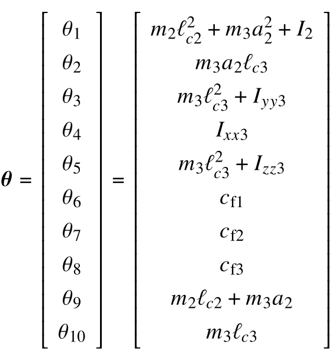
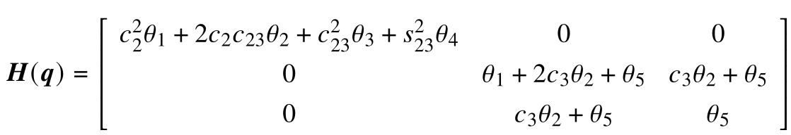
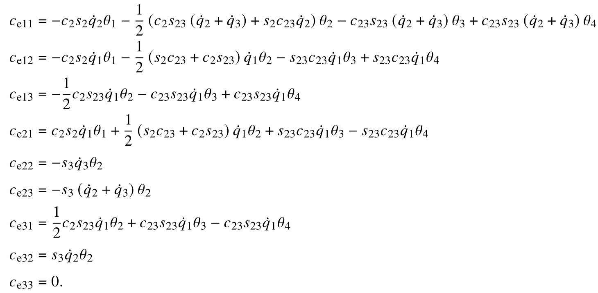
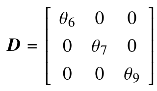
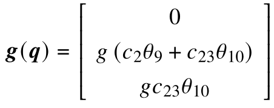

# 🕹️ Geomagic Touch: Simulation & Experimental Validation

This module contains the **MATLAB/Simulink simulation environment** and the **experimental data validation** for the full system parameter identification (robot + payload) using the MDREM algorithm on the Geomagic Touch haptic device.

> ⚠️ **Implementation Note:** Due to laboratory intellectual property guidelines, the low-level C++ control firmware for the physical Geomagic Touch is not publicly shared. However, the complete simulation environment (which mimics the real system dynamics) and the experimental data logs proving hardware convergence are fully provided here.

---

## ⚙️ Technical Implementation Details

To keep this documentation highly scannable, detailed dynamic model and linear parameterization are collapsed below. Click to expand:

<b>1. Denavit-Hartenberg (DH) Parameters</b>

 

Recall that the Geomagic Touch was modeled using a simplified three-degree-of-freedom (3-DoF) configuration. The figure below details this standard Denavit–Hartenberg (DH) geometric setup, and the subsequent table presents the corresponding DH parameters.

  
  
<em>Figure 1.1. Denavit-Hartenberg configuration of the simplified 3 DoF Geomagic touch.</em>

| Joint | $a_i$ [m] | $d_i$ [m] | $\alpha_i$ [rad] | $q_i$ [rad] |
|-------|-----------|-----------|------------------|-------------|
| 1     | 0         | 0         | $\pi/2$          | $q_1^*$     |
| 2     | 0.145     | 0         | 0                | $q_2^*$     |
| 3     | 0.1738    | 0         | 0                | $q_3^*$     |

$*$ variable quantity

<b>2. Dynamic Model</b>

 
  
To achieve a reduced-order parameter formulation, several geometric simplifications were applied to the manipulator's links and payload. To see the full model derivation and  assumptions consult the master's thesis here [view thesis](../docs/Master_thesis_Ernesto.pdf)

The dynamic model then is given by

$$\boldsymbol{H}(\boldsymbol{q}) \ddot{\boldsymbol{q}}+\boldsymbol{C}(\boldsymbol{q},\dot{\boldsymbol{q}})\dot{\boldsymbol{q}}+\boldsymbol{D} \dot{\boldsymbol{q}}+\boldsymbol{g}(\boldsymbol{q})=\boldsymbol{\tau}.$$

The model can be expressed in terms of a set of ten parameters, which are the following:

  
  
<em></em>

where $m_i$ is the mass of the *i*-th link for $i = 1,2,3$; $\ell_{ci}$ is the distance from the origin of the frame $O_{x_{i-1}, y_{i-1}, z_{i-1}}$ to the center of mass of the *i*-th body for $i = 2,3$; $`\boldsymbol{I}_{\mathrm{xx}i}`$, $`\boldsymbol{I}_{\mathrm{yy}i}`$ and $`\boldsymbol{I}_{\mathrm{zz}i}`$ are moments of inertia for $i = 1,2,3$ and $`I_2 = I_{yy2}=I_{zz2}`$;  $c_{\text{f}1}$, $c_{\text{f}2}$ and $c_{\text{f}3}$ are the friction coefficients of joints 1, 2, and 3, respectively; and $a_2$ is a Denavit-Hartenberg parameter given in the table above. The inertia matrix $\boldsymbol{H}(\boldsymbol{q})$ is given by

  
  
<em></em>

where $c_2= cos(q_2)$,  $c_3= cos(q_3)$, $c_{23}= cos(q_2 + q_3)$, $s_2= sin(q_2)$, $s_3 = sin(q_3)$ and $s_{23}= sin(q_2+q_3)$. The elements of the matrix $\boldsymbol{C}(\boldsymbol{q}, \dot{\boldsymbol{q}})$ are given by

  
  
<em></em>

The symmetric positive semidefinite matrix of joint viscous friction coefficients $\boldsymbol{D}$ is described by

  
  
<em></em>

and lastly, the gravity torque vector $\boldsymbol{g}(\boldsymbol{q})$ is given by

  
  
<em></em>

where $g \approx 9.81  m/s$ is gravity.

* **Simulation:** The MDREM algorithm successfully identifies the full parameter vector $`\theta`$ within the ideal Simulink environment.
* **Hardware Validation:** In physical deployment, the geometric simplifications introduce structural modeling uncertainty. Consequently, the experimental validation successfully isolates and identifies the **gravitational dynamic parameters**, which dominate the low-speed static behavior of the manipulator.

<b>3. Linear parameterization</b>

 

There is a model property that says the left-hand side of the dynamic model can be rewritten as the product of the regressor $\boldsymbol{Y}(\boldsymbol{q}, \dot{\boldsymbol{q}}, \ddot{\boldsymbol{q}}) \in \mathbb{R}^{n \times p}$ by a vector of constant parameters $\boldsymbol{\theta} \in \mathbb{R}^p$, that is,

$$\boldsymbol{H}(\boldsymbol{q}) \ddot{\boldsymbol{q}}+\boldsymbol{C}(\boldsymbol{q}, \dot{\boldsymbol{q}}) \dot{\boldsymbol{q}}+\boldsymbol{D} \dot{\boldsymbol{q}}+\boldsymbol{g}(\boldsymbol{q})=\boldsymbol{Y}(\boldsymbol{q}, \dot{\boldsymbol{q}}, \ddot{\boldsymbol{q}}) \boldsymbol{\theta}.$$

As a result, the elements of the regressor $\boldsymbol{Y}(\boldsymbol{q}, \dot{\boldsymbol{q}}, \ddot{\boldsymbol{q}})$ are then given by 

$`\begin{aligned}
& y_{11}=c_2^2 \ddot{q}_1-2 c_2 s_2 \dot{q}_1 \dot{q}_2 \\
& y_{12}=2 c_2 c_{23} \ddot{q}_1-\left(c_2 s_{23}\left(\dot{q}_2+\dot{q}_3\right)+s_2 c_{23} \dot{q}_2\right) \dot{q}_1 \\
& y_{13}=c_{23}^2 \ddot{q}_1-2 c_{23} s_{23}\left(\dot{q}_2+ \dot{q}_3\right) \dot{q}_1 \\
& y_{14}=s_{23}^2 \ddot{q}_1+2 c_{23} s_{23}\left(\dot{q}_2+ \dot{q}_3\right) \dot{q}_1 \\
& y_{15}=0\\
& y_{16}=\dot{q}_1 \\
& y_{17}=y_{18}=y_{19}=y_{110}=0 \\
& y_{21}=\ddot{q}_2+c_2 s_2 \dot{q}_1^2 \\
& y_{22}=2 c_3 \ddot{q}_2+c_3 \ddot{q}_3+\frac{1}{2}\left(s_2 c_{23}+c_2 s_{23}\right) \dot{q}_1^2-2 s_3 \dot{q}_2 \dot{q}_3-s_3 \dot{q}_3^2 \\
& y_{23}=s_{23} c_{23} \dot{q}_1^2 \\
& y_{24}=-s_{23} c_{23} \dot{q}_1^2 \\
& y_{25}=\ddot{q}_2+\ddot{q}_3 \\
& y_{26}=0 \\
& y_{27}=\dot{q}_2 \\
& y_{28}=0 \\
& y_{29}=g c_2 \\
& y_{210}=g c_{23} \\
& y_{31}=0 \\
& y_{32}=c_3 \ddot{q}_2+\frac{1}{2} c_2 s_{23} \dot{q}_1^2+s_3 \dot{q}_2^2 \\
& y_{33}=c_{23} s_{23} \dot{q}_1^2 \\
\end{aligned}`$
  

<b>4.Control law and gains </b>

 

$`\begin{aligned}
\boldsymbol{\tau} & =\hat{\boldsymbol{H}}(\boldsymbol{q}) \ddot{\boldsymbol{q}}_{\mathrm{r}}+\hat{\boldsymbol{C}}(\boldsymbol{q}, \dot{\boldsymbol{q}}) \dot{\boldsymbol{q}}_{\mathrm{r}}+\hat{\boldsymbol{D}} \dot{\boldsymbol{q}}_{\mathrm{r}}+\hat{\boldsymbol{g}}(\boldsymbol{q})-\boldsymbol{K}_{\mathrm{v}} \underbrace{\text{sign}(\boldsymbol{s})|\boldsymbol{s}|^{{\lambda_{\mathrm{s}} \tanh \left(s^2\right)}}}_{\boldsymbol{\tau}_{\mathrm{s}}}-\boldsymbol{K}_{\mathrm{p}}\|\boldsymbol{s}\| \boldsymbol{s}, \\
& =\boldsymbol{Y}_{\mathrm{a}} \hat{\boldsymbol{\theta}}-\boldsymbol{K}_{\mathrm{v}} \boldsymbol{\tau}_{\mathrm{s}}-\boldsymbol{K}_{\mathrm{p}}\|\boldsymbol{s}\| \boldsymbol{s},
\end{aligned}`$

where Property 5 of Section \ref{model properties} and $`\boldsymbol{Y}_{\mathrm{a}}=\boldsymbol{Y}\left(t, \boldsymbol{q}, \dot{\boldsymbol{q}}, \dot{\boldsymbol{q}}_{\mathrm{r}}, \ddot{\boldsymbol{q}}_{\mathrm{r}}\right)`$ has been used for simplicity; $`\boldsymbol{K}_{\text{v}}, \boldsymbol{K}_{\text{p}} \in \mathbb{R}^{n \times n}`$ are diagonal positive definite matrices, and $`\boldsymbol{\lambda}_{\text{s}} \in \mathbb{R}^{n}`$ is a vector of tuning parameters. In addition, the *i*th element $`\tau_{{\mathrm{s}}i}`$ of $`\boldsymbol{\tau}_{\mathrm{s}} \in \mathbb{R}^n`$ is defined as

$$\tau_{\mathrm{s} i}=\text{sign}\left(s_i\right)\left|s_i\right|^{\lambda_{{\mathrm{s}}i}\text{tanh}(s_i^2)}$$

for $i$ = 1, ... , $n$, and with $\lambda_{{\mathrm{s}}i}$ the *i*th positive element of $\boldsymbol{\lambda}_{\mathrm{s}}$, which satisfies

$$\lambda_{\mathrm{s} i} \geq \frac{ \theta_{\mathrm{s} i}}{\tanh (1)}, \quad \theta_{\mathrm{s} i}>1.$$
  

---

## 📂 Module Structure

* `/matlab_scripts/`: Contains initialization scripts (`datosGT.m`), MDREM filter definitions, and plotting utilities.
* `/simulink_model/`: Contains the `.slx` block diagrams for the rigid body plant, and the MDREM estimator.
* `/experimental_results/`: Contains `.csv`/`.mat` datasets collected from the physical lab trials and scripts to plot real-world parameter convergence.

---

## 🚀 Getting Started (Running the Simulation)

To test the estimation algorithm in simulation:

1. **Prerequisites:** Ensure you have MATLAB (R2023b or newer) and the symbolic math toolbox installed.
2. **Initialize Workspace:**
   Navigate to `1_geomagic_touch/` and run `startup.m`, wait a little for the simulink model to open and then you'll be ready to run the simulation. If you want run the simulation one more time, you'll need to reset the simulation data, you can do this by run `startup.m` again or by navigating to `1_geomagic_touch/matlab_scripts` and run `datosGT.m`. You can visualize the estimated parameter errors, and some other data, in the scopes in the simulink model or you can plot it by running the `plots.m` in `1_geomagic_touch/matlab_scripts`.

## View Hardware Results
To view the convergence plots from the real physical robot, run `plot_experimental_data.m` in the `/experimental_results/` folder.
