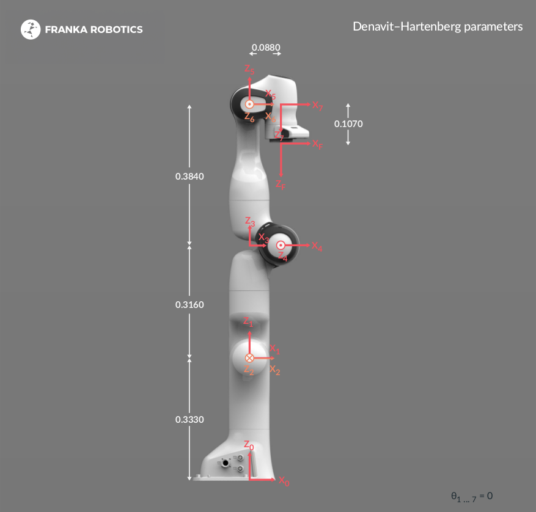
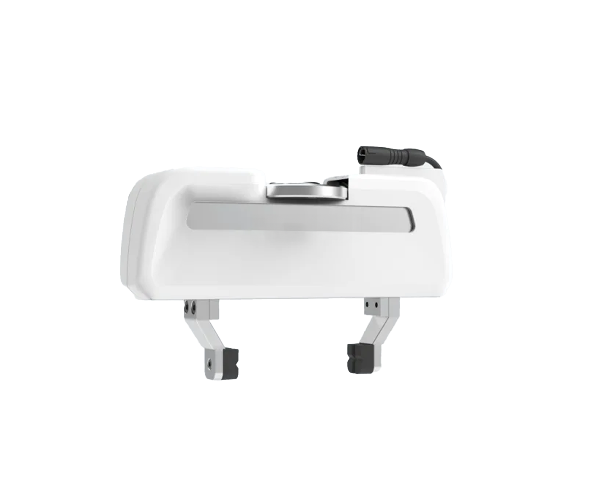

# 🦾 Franka Research 3 (FR3): Real-Time Payload Estimation

This module contains the **C++ hardware implementation** of the Modified Dynamic Regressor Extension and Mixing (MDREM) algorithm deployed on the 7-DOF Franka Research 3 collaborative robot. 

Unlike the Geomagic Touch implementation, this module focuses exclusively on the **unconstrained online estimation of the payload's inertial parameters** (mass, center of mass, and inertia tensor), without any geometrical simplifications, running in real-time within the manipulator's control loop.

---

## ⚙️ Technical Implementation & Robustness

To keep this overview scannable, mathematical parameterizations and details are collapsed below. Click to expand:

<details>
<summary><b>1. Payload Parameterization (The 10 Inertial Parameters)</b></summary>
<br>
The algorithm identifies the standard 10-dimensional inertial parameter vector of the unknown payload attached to the end-effector. The estimated vector $\theta$ is defined as:

` $\theta$ = [ m, m*cx, m*cy, m*cz, Ixx, Ixy, Ixz, Iyy, Iyz, Izz ]^T`

Where:
* `m`: Payload mass.
* `cx, cy, cz`: Mass moments.
* `Ixx ... Izz`: Elements of the inertia tensor at the center of mass.
* 
</details>

<details>
<summary><b>2. Kinematic Configuration</b></summary>
<br>

The kinematic configuration of the Franka research 3 robot follows the modified Denavit–Hartenberg convention or Craig’s convention. The modified D-H convention, in contrast to the original D-H convention, has the particularity of setting the *i*-th coordinate frame at the *i*-th joint. The image below shows kinematic configuration of the robot, while the table shows the  D-H parameters. 

<div align="center">
  
  <p><em>Figure 1.1. Denavit-Hartenberg configuration of the Franka Research 3.</em></p>
</div>

| Joint | $a_i$ [m] | $d_i$ [m] | $\alpha_i$ [rad] | $q_i$ [rad] |
|-------|-----------|-----------|------------------|-------------|
| 1     | 0         | 0.333     | 0                | $q_1^*$     |
| 2     | 0         | 0         | $-\frac{\pi}{2}$ | $q_2^*$     |
| 3     | 0         | 0.316     | $\frac{\pi}{2}$  | $q_3^*$     |
| 4     | 0.0825    | 0         | $\frac{\pi}{2}$  | $q_4^*$     |
| 5     | -0.0825   | 0.384     | $-\frac{\pi}{2}$ | $q_5^*$     |
| 6     | 0         | 0         | $\frac{\pi}{2}$  | $q_6^*$     |
| 7     | 0.088     | 0         | $\frac{\pi}{2}$  | $q_7^*$     |
| **Flange** | 0     | 0.107     | 0                | 0           |

$*$ variable quantity

The dynamic model of the FR3 robot is derived from the Newton-Euler (NE) formulation. In the NE formulation, each link is represented by ten inertial parameters. For this reason, in the linear parameterization model, the regressor results in a 7-by-70 matrix (7-by-80 if the payload is included), which makes it dificult to show here, so it is omitted.


</details>

<details>
<summary><b>3. Baseline Uncertainty & Bounded Convergence</b></summary>
<br>
  
A critical highlight of this experimental deployment is its robustness against unmodeled baseline dynamics. 

The known robot dynamic parameters (used to compensate the baseline internal dynamics) were derived from literature reported for the predecessor model, the **Franka Emika Panda**. Despite the physical and parametric discrepancies between the Panda and the FR3, the MDREM estimator did not diverge. Instead, except for one estimated parameter, it successfully rejected the structural uncertainty, driving the payload estimation error to a **bounded, practical neighborhood** of the true values.

The set of parameters used in experimentation for the FR3 robot are reported in [Soto et al. (2024)](https://www.researchgate.net/publication/386429138_Nonlinear_Parameter_Identification_of_the_Franka_Emika_PANDA_Robot_A_Comparative_Analysis_of_Friction_Models), and they're shown in the following table:

| $\theta$              | Link 1   | Link 2   | Link 3   | Link 4   | Link 5   | Link 6   | Link 7   |
|-----------------------|----------|----------|----------|----------|----------|----------|----------|
| $m$ (kg)              | 4.75     | 0.9918   | 3.2832   | 3.5858   | 1.3628   | 1.741    | 0.5158   |
| $c_x$ (m)             | -3.48e-08| 0.0396   | 0.0345   | -0.0474  | -0.0016  | 0.0733   | -0.0015  |
| $c_y$ (m)             | -3.48e-08| -0.1222  | 0.0351   | 0.1385   | 0.0307   | -0.0205  | 0.004    |
| $c_z$ (m)             | -0.175   | -0.0096  | -0.0999  | 0.0327   | -0.125   | -0.0262  | 0.0638   |
| $I_{xx}$ (kg·m²)     | 0.5      | 0.0752   | 0.0528   | 0.0285   | 0.0669   | 0.0066   | 0.0005   |
| $I_{yy}$ (kg·m²)     | 0.5      | 0.0297   | 0.0102   | 0.0064   | 0.0534   | 0.0053   | 0.0019   |
| $I_{zz}$ (kg·m²)     | 0        | 0.016    | 0.0183   | 0.0486   | 0.0022   | 0.0006   | 0.0001   |
| $I_{xy}$ (kg·m²)     | 7.72e-14 | 0.0098   | -0.0195  | 0.0072   | -0.0039  | -0.0033  | -0.0009  |
| $I_{xz}$ (kg·m²)     | -8.56e-10| -0.02    | -0.0298  | -0.0241  | -0.0112  | -0.0002  | -0.0002  |
| $I_{yz}$ (kg·m²)     | 8.55e-10 | -0.0201  | 0.0131   | 0.0053   | 0.0048   | 0.0015   | 0.0005   |

Table 3.1. Estimated parameters of the Franka Emika Panda robot used in the experiment.

</details>

<details>
<summary><b>4. Experiment payload</b></summary>
<br>
  
The experiment payload used in this used was the hand gripper of the Franka Research 3 robot and it is shown in the image below. The payload parameters are known a priori and therefore, its corresponding parameters are shown in the table below. They were obtained from [Chapter 6, Tool Compensation for a Medical Cobot-Assistant](https://link.springer.com/chapter/10.1007/978-3-030-95750-6_6).

<div align="center">
  
  <p><em>Figure 4.1. Robot's payload: Hand gripper of the FR3 robot.</em></p>
</div>

| $\theta_L$          | Value       |
|---------------------|-------------|
| $m$ (kg)            | 0.730       |
| $c_x$ (m)           | -0.010      |
| $c_y$ (m)           | 0           |
| $c_z$ (m)           | 0.030       |
| $I_{xx}$ (kg·$m^2$) | 0.001       |
| $I_{yy}$ (kg·$m^2$) | 0           |
| $I_{zz}$ (kg·$m^2$) | 0           |
| $I_{xy}$ (kg·$m^2$) | 0.0025      |
| $I_{xz}$ (kg·$m^2$) | 0           |
| $I_{yz}$ (kg·$m^2$) | 0.0017      |

Table 4.1. Inertial parameters of the FR3 hand gripper.

</details>

There are more other details particular to the implementation for the FR3 robot. If you wan to know more, please consult my [*master's thesis*](https://tesiunamdocumentos.dgb.unam.mx/ptd2026/ene_mar/0881038/Index.html).

---

## 📂 Software Architecture & Structure

The codebase is organized into two main components: a standard **ROS 2 (C++) package** for real-time execution, and a post-processing folder for experimental data analysis.

* `/mdrem_algorithm/` **(ROS 2 Package)**
  * `/src/`: Core C++ implementation of the MDREM algorithm, dynamic regressor computations, and the ROS 2 node managing the hardware loop.
  * `/include/`: C++ header files, class declarations, and mathematical utilities (e.g., Eigen matrix definitions).
  * `CMakeLists.txt` & `package.xml`: Build system configurations and package dependencies for the `colcon` workspace.

* `/experimental_results/` **(Data Analysis)**
  * `*.txt`: Raw dataset logs recorded during the physical payload lifting trials on the FR3 hardware.
  * `plot_fr3_data.m`: MATLAB script designed to parse the `.txt` logs and generate the parameter convergence and error plots.

---

## 🚀 Getting Started 

### 1. Prerequisites (ROS 2 Environment)
The real-time controller is built as a native ROS 2 package. To compile and run it, you need the following standard environment:
* **OS:** Linux Ubuntu 22.04 (Jammy Jellyfish)
* **Middleware:** ROS 2 Humble
* **Compiler:** C++17 (Standard for ROS 2 Humble)
* **Libraries:** Eigen 3 (for fast matrix algebra)

### 2. Compilation (Building from Source)
Ensure you have sourced your ROS 2 environment. Clone this repository into the `src` folder of your general ROS 2 workspace (not to be confused with the package's internal `src` folder). 

Assuming your workspace is named `~/franka_ros2_ws` (you can replace this with your own workspace name):

```bash
# 1. Source your ROS 2 Humble installation
source /opt/ros/humble/setup.bash

# 2. Navigate to your ROS 2 workspace root
cd ~/franka_ros2_ws

# 3. Build the specific package
colcon build --packages-select mdrem_algorithm

# 4. Source the local workspace setup
source install/setup.bash
```

### 3. Execution & Trajectory Planning
> **Note on Trajectory Generation:** In the experimental setup, the dynamic excitation trajectories were generated using **MoveIt 2**. 

To perform the online parameter estimation, the estimator node must be running concurrently while a trajectory is executed on the manipulator.

```bash
# 1. Source the workspace
source install/setup.bash

# 2. Run the MDREM estimator node
ros2 run mdrem_algorithm mdrem_node
```
*Once the node is actively running, you can execute your desired excitation trajectory (via MoveIt or your preferred trajectory generator), and the node will compute the payload parameters in real-time.*

### 4. View Experimental Results (MATLAB)
Since testing on physical FR3 hardware requires strict laboratory safety protocols and the specific robot setup, you can verify the algorithm's performance directly using the recorded datasets provided in this repository.

1. Open MATLAB and navigate to the `/experimental_results/` directory.
2. Run the `plot_fr3_data.m` script. 
3. The script will parse the raw `.txt` logs and generate the convergence plots for the payload mass, center of mass, and inertia tensor.
